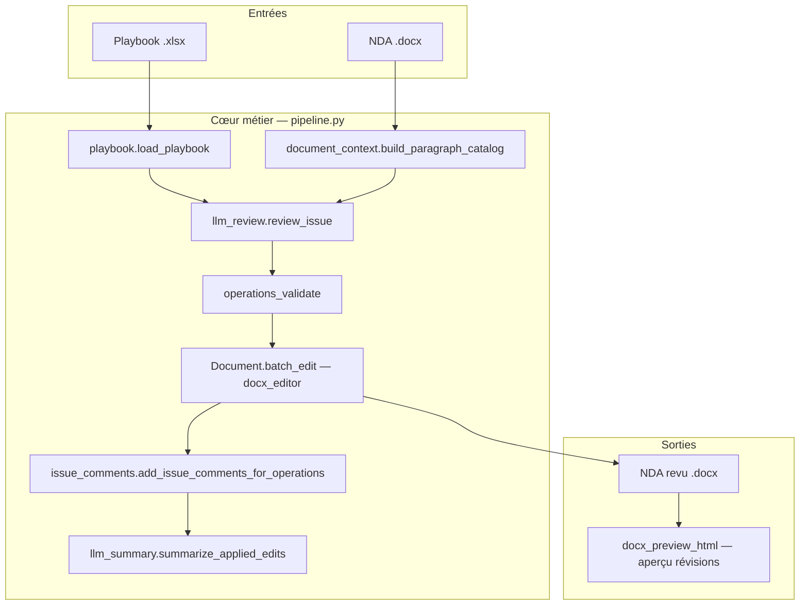

# NDA Generator (NDA Manager)

Application qui applique une **revue contractuelle guidée par playbook** : un fichier Excel décrit les enjeux de négociation (issues) ; un modèle de langage (Claude via Anthropic) propose des modifications ciblées sur le NDA au format **Word (.docx)**. Les changements sont matérialisés en **révisions suivies** (texte barré / inséré) grâce à la bibliothèque **docx-editor**, avec commentaires Word liés à chaque issue.

---

## Prérequis

- **Python** 3.10 à 3.x (`requires-python` dans `pyproject.toml`)
- Clé API **Anthropic** (`ANTHROPIC_API_KEY`), optionnellement `ANTHROPIC_MODEL` (voir `.env.example`)
- Gestionnaire de paquets : **uv** ou **pip** (le projet est packagé avec Hatch)

---

## Installation et lancement

```bash
uv sync
cp .env.example .env   # puis éditer ANTHROPIC_API_KEY
```

**Interface web** (FastAPI + fichiers statiques) :

```bash
uv run python -m nda_generator.web
# ou : uv run nda-web
```

Par défaut : `http://127.0.0.1:8765` — upload du NDA (.docx) et du playbook (.xlsx), suivi par issue (SSE), téléchargement du document revu, aperçu HTML des révisions.

**Ligne de commande** (sans serveur) :

```bash
uv run nda-review --nda chemin/nda.docx --playbook chemin/playbook.xlsx --out sortie.docx --author "Prénom Nom"
```

Les chemins par défaut du CLI pointent vers `NDA_Exemple.docx`, `NDA_Playbook.xlsx` et `NDA_revu.docx` dans le répertoire courant.

---

## Architecture (vue d’ensemble)



- **`pipeline.run_review`** orchestre tout : chargement du playbook, boucle sur chaque issue, appels LLM, validation, écriture dans le document, synthèses, sauvegarde.
- **`web.py`** expose l’UI, crée des **jobs** avec fichiers temporaires, enchaîne `run_review` dans un thread et diffuse la progression en **Server-Sent Events** (`/api/jobs/.../events`). Un mode **POST `/run`** sans SSE reste disponible pour compatibilité.

---

## Organisation du code

| Fichier | Rôle |
|--------|------|
| `pipeline.py` | Orchestration `run_review` : issues, callbacks de progression, annulation, `doc.save` / `doc.close`. |
| `playbook.py` | Lecture du `.xlsx` (openpyxl) → liste de `PlaybookIssue` (nom, positions préférée / fallback, libellé cible). |
| `document_context.py` | `build_paragraph_catalog` : texte envoyé au LLM, paragraphes référencés `P{n}#hash` + corps visible. |
| `llm_review.py` | Prompt système, appel Anthropic, parsing JSON → `EditOperation`, fonction `review_issue`. |
| `operations_validate.py` | Détection des lots **delete + insert** sur le même paragraphe (à remplacer par `replace` en mode strict). |
| `issue_comments.py` | Commentaires Word sur les zones modifiées, libellés par nom d’issue. |
| `llm_summary.py` | Second appel LLM : compte rendu HTML (nh3) des modifications réellement appliquées ; rapports statiques en cas d’erreur. |
| `paragraph_refs.py` | `paragraph_indices_from_operations` : indices de paragraphes pour l’UI / surbrillance dans l’aperçu. |
| `ops_logging.py` | Journalisation détaillée des opérations pour le debug. |
| `docx_preview_html.py` | Conversion du `.docx` en fragment HTML avec ins/del de révision ; titres ; fallback mammoth si besoin. |
| `web.py` | FastAPI : jobs, SSE, cancel, preview, log, download, route `/run`. |
| `cli.py` | ArgumentParser + `run_review` pour usage terminal. |

Le front statique (`nda_generator/static/`) : `index.html`, `app.js`, `styles.css`.

---

## Principales fonctions (succinct)

- **`run_review`** (`pipeline`) — Point d’entrée métier : ouvre le NDA, pour chaque issue construit le catalogue, appelle `review_issue`, valide/applique les opérations, ajoute commentaires et synthèse, propage les événements de progression ; gère l’arrêt demandé par l’utilisateur.
- **`load_playbook`** (`playbook`) — Parse la feuille active : ligne d’en-tête « NOM DE L’ISSUE » / colonnes preferred, fallback, wording ; retourne les lignes de données.
- **`build_paragraph_catalog`** (`document_context`) — Assemble le texte structuré `P{n}#hash` + contenu pour le prompt de revue.
- **`review_issue`** (`llm_review`) — Envoie l’issue et le catalogue à Claude ; retourne la liste d’`EditOperation` et le JSON brut pour les logs.
- **`explain_delete_insert_violation`** (`operations_validate`) — Retourne un message si le batch mélange suppression et insertion sur un même paragraphe (rejet possible si `--strict-ops`).
- **`add_issue_comments_for_operations`** (`issue_comments`) — Attache des commentaires Word aux ancres textuelles post-édition.
- **`summarize_applied_edits`** (`llm_summary`) — Génère le HTML de synthèse par issue ; **`format_static_issue_report`** pour les cas sans modification ou en erreur.
- **`paragraph_indices_from_operations`** (`paragraph_refs`) — Extrait les `P{n}` pour la mise en évidence dans l’iframe d’aperçu.
- **`log_operations`** (`ops_logging`) — Trace lisible de chaque opération.
- **`docx_revision_html_fragment`** (`docx_preview_html`) — HTML des révisions pour l’aperçu navigateur du job web.

---

## Playbook Excel

Le fichier doit contenir une ligne d’en-tête reconnaissable (colonne type « NOM DE L’ISSUE », « PREFERRED… »). Les lignes suivantes décrivent chaque point de négociation : nom, position préférée, repli, formulation cible — utilisés tels quels dans le prompt envoyé au modèle.

---

## Dépendances notables

- **anthropic** — API Messages
- **docx-editor** — Ouverture DOCX, `batch_edit`, révisions et commentaires
- **fastapi** / **uvicorn** — Serveur web
- **openpyxl** — Lecture du playbook
- **mammoth** — Secours pour HTML si la conversion révisions échoue
- **nh3** — Assainissement HTML des synthèses
- **python-dotenv** — Chargement `.env`

---

## Licence et contribution

Adapter selon la politique du dépôt (non précisée dans le projet).
